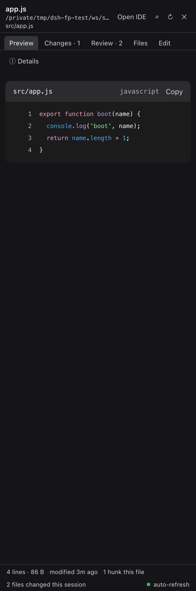
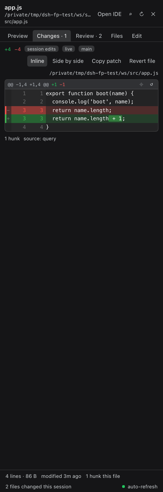
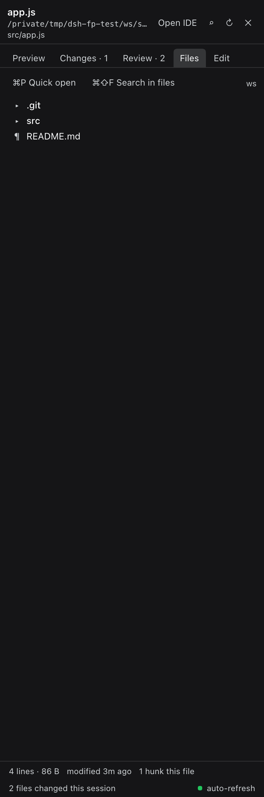
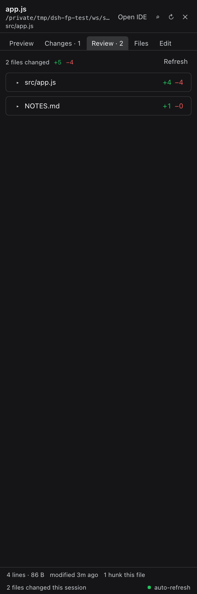

# dsh-file-panel

Antigravity-style in-app file panel for **DSH Desktop / DeepSeek Harness**.

Clicking a workspace path in the chat no longer hands the file to the OS default
app: the click opens a **right-side panel** in the harness window — preview with
syntax highlighting, the session's own edit diff, a workspace tree, and an
in-place editor with a stale-guarded save.

Everything lives outside the `.app` bundle: host routes + a client bundle
installed into the `web` profile, exactly like any other DSH plugin.

## What it does

| Surface | Behaviour |
|---|---|
| File link in chat / tool card / deliverables | Opens the panel at exactly the path the link names — the string the link carries, joined to the workspace root when it is relative. No basename hunting, no nearest-match search: a link to something that is not there reports the absolute path it tried. |
| Path written in a message | A path that is only text — inline code or plain prose — is clickable too. The token under the pointer is read from the character you are actually on, joined to the workspace root when relative, home-expanded when it starts with `~`, and handed to the same on-disk gate. Paths that are really paths get a dotted underline; `and/or` and `24/7` are left alone. Modifier-clicks are never intercepted. |
| Turn navigator | DSH's 28px leap-to-turn rail sits where a panel wants to live, so the panel parks it: `window.__dshFilePanel.debug.hideTurnRail(false)` brings it straight back. |
| Tabs | One tab per file, per session, closable, last 12 kept |
| `Preview` | Line-numbered + highlighted (`ReadBlock`), markdown rendered (`MarkdownText`), images/PDFs inline through the raw route |
| `Changes` | IDE-grade diff: `@@ -a,b +c,d @@` headers with real line ranges, coloured two-sided gutters, change bars, hatched filler rows, word-level emphasis, long-context collapsing, hunk jump, inline **or** side-by-side, per-hunk **revert**, whole-file revert, unified-patch copy |
| `Review` | Every file the agent changed this session with `+N −M`, expandable before/after, per-file open/revert/patch |
| `Files` | Lazy tree with change badges, **⌘P quick open**, **⌘⇧F content search** (bundled ripgrep) |
| `Edit` | In-place editing, `⌘S` save, atomic write, `409` when the file moved under you |
| Line work | Click (or shift-click) a line → copy `path:line` reference, add a review note |
| Notes | Per-session review notes with copy-out, for steering the agent |
| Auto-refresh | Polls the open file; a dirty editor is marked *changed on disk* instead of being overwritten; a green dot shows the live state |
| Narrow windows | When the layout resolves the right column to 0 (its centre column demands 640px), the panel docks as a slide-over pinned to the window with its own drag handle, instead of rendering invisibly |
| Edit & resend a message | Hover a message you sent and a ✎ appears next to it: rewrite it and press **Gửi lại**. DSH's log is append-only, so resend means what it means in DSH — the session is branched from the turn *before* that message (the fork point is read from the session log through the host, not guessed from the page) and the edited text is sent into the branch, which DSH then opens. The first message of a session has nothing to branch from, so DSH opens a new session in the same directory instead. Nothing is written into the app's DOM: the pencil and the editor are the plugin's own overlay, and the app is only asked through its own session service. `debug.chatEditEnable(false)` turns it off. |
| Close | It stays where it was put. The panel closes when **you** close it: ✕, `Esc`, or `⌥⌘F`. Opening another file switches the panel to that file instead of putting it away, and a click anywhere else in the app changes nothing. |
| When the app opens its own panel | DSH's tool-details panel takes the right column for a tool call; the file panel stands down while that column is up — tabs, open file and notes all kept — and the dock returns the moment the column closes. |

Keyboard: `⌘S` save · `⌘F` find in file · `⌘⇧F` search in files · `⌘P` quick open · `⌘W` close tab · `Esc` closes palette → find → panel.

The panel borrows the layout's `details` seat **only while it is open**
(`priority: -1000`), so tool-call details keep working untouched: clicking a tool
call closes the panel and restores the shipped panel.

## Screenshots

Captured from a live rig (synthetic session, fixture workspace) — cropped to the
panel itself, never the chat:

<p align="center">
  
  
  
  
</p>

*Preview · Changes · Files · Review — the panel docked in the harness' right column.*

## Install

Requirements: DSH Desktop 0.8.x, Node 20+. Launch DSH Desktop at least once so it
creates its harness home.

**One command, any machine** (macOS, Linux, Windows):

```sh
npx --yes github:thanhdz235123-commits/dsh-file-panel install
```

Then reload the DSH window — `Cmd-R` / `Ctrl-R`. The host half is picked up by the
profile's patch watcher immediately; the client half needs the reload.

From a checkout, or offline:

```sh
git clone https://github.com/thanhdz235123-commits/dsh-file-panel
cd dsh-file-panel
node bin/dsh-file-panel.mjs install
```

Point it somewhere else when the harness home is not the default:

```sh
node bin/dsh-file-panel.mjs install --home "/path/to/harness" --profile web
```

### Supported platforms

| OS | Harness home the installer picks |
|---|---|
| macOS | `~/Library/Application Support/dsh-desktop/harness` |
| Linux | `$XDG_CONFIG_HOME/dsh-desktop/harness`, else `~/.config/dsh-desktop/harness` |
| Windows | `%APPDATA%\dsh-desktop\harness` |

Everything is Node 20+ and browser APIs: paths go through `node:path`, the panel
learns the host's separator from `/api/dsh-file-panel.health`, and the bundled
ripgrep is resolved as `rg` or `rg.exe`. `git` is optional — without it the
`Changes` tab reports session edits only. Run the installer's `doctor` to see what
a machine is missing:

```sh
npx --yes github:thanhdz235123-commits/dsh-file-panel doctor
```

### What the installer does

Two shapes, and they never overlap — pick one:

| Shape | Command | How it activates |
|---|---|---|
| **copy** (default) | `install` | files land in `<profile>/node_modules/dsh-file-panel`, inserted from the profile's own patch layer. No package manager runs, no lockfile is touched. |
| **dependency** | `install --dep` | adds `dsh-file-panel` to `<profile>/package.json` dependencies + `dsh.profile.bundles`; the profile's own package manager installs it. The bundle brings its patch layer along, so no hand-written row is written. |

```sh
node bin/dsh-file-panel.mjs status     # what is installed where, and which build
node bin/dsh-file-panel.mjs doctor     # is this machine able to host it
node bin/dsh-file-panel.mjs uninstall  # remove the package, the patch row and the dependency
```

`--dep` installs from `github:thanhdz235123-commits/dsh-file-panel` by default; pass
`--spec <spec>` for a fork, a tag (`github:you/dsh-file-panel#v0.3.4`) or a local
path (`file:/path/to/checkout`). Every command is idempotent, and `uninstall`
removes exactly what `install` wrote — an emptied patch layer is reset to `[]` so
the YAML stays parseable.

## Configuration

A JSON body/query option per route; the panel itself has no settings file:

- `POST /api/dsh-file-panel.write` refuses any path outside the session
  workspace (`403`) and any save whose `expectedSha256` no longer matches (`409`).
- The poll interval is `POLL_INTERVAL_MS` in `client.js` (default 2000 ms).

## Host routes

All exact Fetch routes on the `connection` service, so they inherit the browser
session auth fence (`401` without the harness cookie, `403` on a foreign
`Origin`/`Host`).

| Route | Purpose |
|---|---|
| `GET /api/dsh-file-panel.file?path&cwd` | content, language, lines, size, mtime, sha256, canonical path, repo info |
| `GET /api/dsh-file-panel.raw?path&cwd` | raw bytes with a content type (images, PDF, media) |
| `GET /api/dsh-file-panel.tree?path&cwd` | one directory level (dirs first, 4000-entry cap) |
| `GET /api/dsh-file-panel.search?q&cwd&kind=files\|content&limit` | quick-open walk, or content search through the harness' bundled ripgrep |
| `GET /api/dsh-file-panel.changes?sessionId&cwd` | every path changed in the session, with `+N −M` |
| `GET /api/dsh-file-panel.diff?path&cwd&sessionId&source` | hunks: `session` (`data.meta.diffs`), `git` (`git diff HEAD`), or `none` |
| `GET /api/dsh-file-panel.stat?path&cwd` | size/mtime (poll) |
| `POST /api/dsh-file-panel.write` | atomic write + stale guard |
| `POST /api/dsh-file-panel.revert` | chunk-level undo: replace one hunk's `newText` with its `oldText` under the same guard |
| `GET /api/dsh-file-panel.health` · `.probe` | service probe · session reader diagnostics |

## How the session diff is read

The panel keeps a **live per-session diff index** instead of re-scanning logs:

1. **Seed, once per session** — `ctx.sessionQuery.readSession(id)` (the harness'
   own complete pass) and, for sessions it refuses or has not persisted, the log
   under `$DSH_HOME/sessions/<group>/<id>/session.jsonl.zstd` decoded **frame by
   frame**. A DSH log is one concatenated Zstandard frame per append; boundaries
   come from walking the frame/block headers (the magic byte pattern also occurs
   inside compressed payloads) because Node's `zstdDecompressSync` decodes only
   the first frame. The log seed is bounded (newest 6000 frames) and yields to
   the event loop between batches, so it never stalls the harness.
2. **Stay fresh for free** — `ctx.on('session/event', …)` folds every later
   `tool/result` carrying `meta.diffs` into that index (dedup by `seq`). Panel
   reads are then O(1): measured on a 4.5 MB / 208k-event session, the first read
   costs ~5 s (the harness' own pass) and every read after it ~20 ms, with no
   re-read even minutes later.

Responses carry `live` / `sessionLive` so the source is visible. Without hunks
the `Changes` tab falls back to `git diff HEAD`, and reports `none` when the
worktree is clean.

## Verified on a live 4.5 MB session

Measured on the harness' own running instance (208k logged events): the seeding
read costs ~5.7 s once per session, every read after it **0.02 s with
`live: true`**, and a real agent tool edit lands in the `Changes` tab through the
session event stream — no re-read.

## Restarting

The client half is hot-reloaded by the harness (~0.5 s after `client.js` changes).
**Host-half changes need a restart** (module-level HMR needs Node internals the
packaged host cannot provide): quit DSH Desktop, relaunch it.

## Known limits

- The right column only renders for a **current session that is not blank** (the
  layout's own gate). Without one, the click keeps opening the file externally
  instead of swallowing it.
- A hand-written session log that is not byte-exact can make
  `sessionQuery.readSession` refuse the whole log; the persisted-log fallback
  covers it.
- Binary and >1.5 MB files are announced, not rendered.
- `Open IDE` reuses the captured native opener — it is the pre-existing
  behaviour, unchanged.

## Where this mirrors Antigravity

The panel follows the Antigravity artifact/review surfaces: an in-app review
column instead of an external editor, chunk-level accept/reject (here: revert),
inline **and** side-by-side diff modes, per-file change list, markdown and image
artifacts, and code search from the same column — see the
[Antigravity artifacts docs](https://antigravity.google/docs/artifacts) and the
[diff-view guide](https://antigravitylab.net/en/articles/editor/antigravity-diff-view-advanced-guide).

## Changelog

- **0.6.0** — a sent message can be rewritten and resent. Hover a user message: a ✎ button appears beside it (the plugin's own overlay — the app's DOM is not touched), click it and the message opens in an editor anchored under the bubble, with `Hủy` / `Gửi lại` and ⌘↵ to send. Because DSH's log is append-only, resending branches the session: the fork point is the message *before* the edited one, read from the session log through the host (`/api/dsh-file-panel.chat`), so the branch keeps a clean history, and DSH opens the new session with the edited text already sent into it. The first message of a session has no earlier turn to branch from, so a fresh session in the same directory is created instead. Also in this build: a `chat` host route that returns the session's user turns with their log sequence numbers, and four new checks that drive the whole flow (open, prefill, cancel, branch).
- **0.5.5** — the file strip works again. Clicking a tab did nothing: the click handler called `activateTab`, which had gone missing in an earlier refactor, so switching back to an already-open file died silently while its ✕ still closed it. The function is back (activate, load what never loaded, paint) and the suite clicks a tab in both directions so it cannot vanish again unnoticed.
- **0.5.4** — the panel stops closing itself. Clicking a file while it was open used to close it (the click landed "outside" the panel), so the file needed a second click; nothing on the page closes it now. Opening another file switches the panel to it, and the only ways out are the ones the operator asks for: ✕, `Esc`, `⌥⌘F`. The panel also never lives in the layout's details column any more — it always docks — so the app's own panel is never shadowed; when that column opens (a tool call, a search result) the file panel stands down with every tab kept and comes back by itself when the column closes.
- **0.5.3** — a path in a message is a door, and the rail is parked. DSH makes exactly one thing in a conversation clickable (the chip on a tool row), so a path written in prose or in inline code did nothing at all — which reads as "the plugin is not there". The panel now reads the token under the pointer: `document.caretPositionFromPoint` for prose, the whole code span for inline code (so paths with spaces work), trimmed of punctuation, rejected when it is a URL or a `24/7`, then resolved exactly as written and put through the same on-disk gate — a path that is not there is refused with its own name, never substituted. Paths that really are paths get a dotted underline and a pointer cursor (`debug.clickPaths(false)` turns the whole thing off). The turn navigator is parked by default instead of sitting in the panel's corner (`debug.hideTurnRail(false)` restores it). While the panel is up the conversation gives it room — one scoped rule on the column that already owns that space, removed the moment the panel closes, with a 560px floor for the chat and nothing written into DSH's DOM. `~` now means home on every platform.
- **0.5.2** — leftovers are swept. A client hot-reload leaves the previous generation's React tree mounted (its disposer dies with its module instance), and inside the layout's 0px details column that tree overflows as a strip of marks stuck to the window edge. Loading now retires the previous generation and removes anything of ours that is on screen while the panel is closed; a 15s sweep keeps it clean, and every sweep is reported (`reason: strays` or `swept` in the diagnostics file).
- **0.5.1** — the panel stops shadowing the app's own panel. The seat it takes in the layout's `details` slot outranked DSH's own entry, so clicking a tool call opened **the file panel** instead of the tool details — the app's own panel appeared to be broken. The panel now watches the details column and steps aside the moment the layout opens it, and it no longer wraps the layout service's `openDetails` at all (a monkey-patch on a service the app owns is how a plugin takes the app down with it). Loading is also louder: if `apply` fails, the reason is left in `window.__dshFilePanel.error` instead of the plugin silently doing nothing.
- **0.5.0** — the panel stops touching anything it does not own. All of it is gone: padding injected into the layout's centre column, attributes written onto `body`, DSH elements hidden by class, and the floating `‹ File panel` tab. The panel now draws **only itself** — one fixed-position surface, 32% of the window (300–420px) at the right edge, with the layout's columns left exactly as DSH drew them. Open it by clicking a file path in the chat (or `⌥⌘F`); close it by clicking anywhere outside, `Esc`, or the ✕. A panel that opens with nothing to show now says so instead of drawing nothing.
- **0.4.3** — the panel sizes itself to the window it is in. Default width is 32% of the viewport (300–420px) instead of a flat 420, the box is `border-box` so the number is the real width, and the conversation is only inset when it keeps at least 700px of content — below that the panel floats over the edge rather than squeezing the chat into a column.
- **0.4.2** — the panel carries its own black box. The client reports the window it is really running in — build, mode, panel rect, the layout's column widths, how much it inset the chat — to `POST /api/dsh-file-panel.diag`, and the host appends it to `dsh-file-panel-diag.jsonl` next to the harness home; the window title carries the same summary. A report from another machine can now be read instead of guessed at.
- **0.4.1** — the panel fits the room it is given. Whether it takes DSH's own right column is now decided by measuring that column **before** anything mounts (a seat inside a 0px column painted a sliver of overflowing content at the window edge), and when there is no column the slide-over insets the conversation by at most `centre − 520px`, so the chat keeps a readable width instead of being squeezed. DSH's column open ⇒ the panel lives in it, nothing is inset, nothing is covered.
- **0.4.0** — the panel pushes, it never covers, and there is always a way in. The slide-over now insets the conversation (`centerCol` padding = the panel width) instead of laying over it; a slim `‹ File panel` tab sits on the right edge (click to open/close, `⌥⌘F` from anywhere), and it rides the panel's leading edge while the panel is open. Opening with no file shows the workspace tree. The panel only appears when asked — a file click, the tab, or the shortcut.
- **0.3.9** — — the slide-over never traps you: clicking anywhere outside it, or pressing Escape, puts the panel away; its width is capped at 45% of the window; and a dock with nothing to show (no tab, no notice) is not drawn at all, so it cannot sit over the conversation looking broken.
- **0.3.8** — the panel is never invisible. Whether it takes the layout's right column is now **measured** (the column's real width), not predicted from a copy of the layout's column maths: at some window sizes the column resolves to 0 and the mounted panel used to sit there as a 0px strip that still held the slot, which looked exactly like a broken UI. A `ResizeObserver` flips between the column and the slide-over dock the moment the layout changes its mind.
- **0.3.7** — nothing opens unless it is on disk. Every entry point (chat link, tool row, tree row, quick open, review row) runs a `stat` first: a path that is not there is refused with the exact absolute path it tried and **no tab is created**, so the panel can never look like it opened a file that does not exist. Directory links still open the tree. The host refuses to serve bytes for a missing path (`404 not-found`) and refuses anything that is not a regular file.
- **0.3.6** — the `Edit` surface is an IDE-shaped editor: line-number gutter that scrolls with the text and highlights the caret line, current-line band, `Ln, Col`, Tab of two spaces, auto-indent on Enter, sha-guarded `Cmd-S` save, and `Revert edits`.
- **0.3.5** — a link opens **exactly** the path it names. The basename resolver (and its "pick one of these similar files" list) is gone: a link to `<root>/index.js` opens that file or says it is not there, it never opens a same-named file from somewhere else. The error state shows the exact link string and the absolute path it resolved to, plus an opt-in `Search workspace` button that opens nothing until you pick. Server-side `resolve` stays available as an API for tooling; the link flow no longer calls it.
- **0.3.4** — one file is now one tab, always. A chat link is resolved **before** its tab exists (so a wrong spelling can no longer leave an empty duplicate tab next to the real file) and every async result is matched to its tab by a stable id instead of by a path string. Added: a full-path bar under the file name (click to copy), a file-details strip (path, relative, size, lines, modified, sha256, language, encoding, session +/- , link origin), tooltips with the absolute path on tree rows, `Copy path` in Review, an `Opening <path>…` banner while a link resolves, an on-demand load when you select a tab that has nothing loaded, and a 120-entry event trace in `window.__dshFilePanel.state(sessionId).events`.
- **0.3.3** — fixed a `ReferenceError` in the image surface that crashed the panel and made the slot framework abdicate it (every later surface silently disappeared); the panel now docks in narrow windows instead of rendering at 0px; a resolved link no longer leaves a dead tab.
- **0.3.1** — rebuilt the diff renderer: aligned LCS rows with real old/new line numbers, IDE theme colours, change bars, hatched empty sides, collapsible context, single-line hunk headers with `⌖` jump and `↺` revert, plus a narrow-panel hint for side-by-side.
- **0.3.0** — multi-tab files, Review surface, per-hunk/whole-file revert, side-by-side diff with word-level emphasis, quick open + ripgrep content search, markdown and image preview, line selection + notes; **fixed** the panel leaking one session's file into another session's column (the seat now closes when the session changes).
- **0.2.1** — live per-session diff index (seed once, then `session/event`), so panel reads stay O(1).
- **0.2.0** — correct Zstandard frame walking, bounded/yielding log scans, canonical path matching, non-blocking client loads.

## License

MIT
